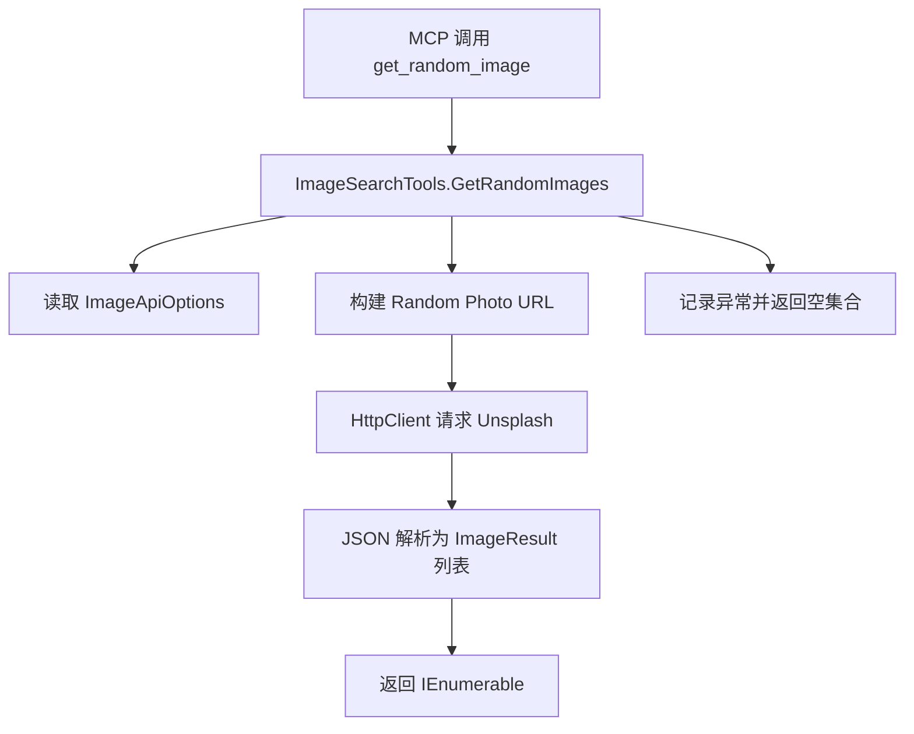

# 设计文档 - get-random-image-tool

## 概述
本设计针对现有 MCP 工具 `get_random_image` 进行增强，使其在调用 Unsplash `/photos/random` 接口时具备参数清洗、取值约束、大小写兼容与更稳健的响应解析能力。目标是确保调用方能够在 1 至 5 张范围内获取符合主题与方向要求的图片结果，同时保持与 `ImageSearchTools` 现有结构兼容。相关接口行为参考 Unsplash 官方文档（https://unsplash.com/documentation#get-a-random-photo），该文档说明可选参数 `query`、`orientation` 以及 `count` 的上限。

## 架构
增强后的流程仍驻留在现有的 `ImageSearchTools` 静态类中：

该设计复用现有依赖：`HttpClient`、`IOptions<ImageApiOptions>`、`System.Text.Json`，仅在方法内部新增参数处理与响应自适应逻辑。

## 组件与接口
- `ImageSearchTools.GetRandomImages`
    - 方法签名保持不变，但在实现中新增：
        - 将 `query` 去除首尾空白并在存在内容时进行 URL 编码；为空或仅空白时不附加该参数。
        - 对 `count` 进行 `Math.Clamp(count, 1, 5)`，以满足需求对请求数量的上限约束。
        - 对 `orientation` 做大小写不敏感判断，仅允许 `landscape`、`portrait`、`squarish`；其余值回退到默认 `landscape`。
        - 统一构建 `UriBuilder` 或字符串拼接，确保 `BaseUrl` 与 `photos/random` 之间的斜杠处理正确。
        - 继续通过扩展方法 `ReadJsonDocumentAsync` 发送请求并获得 `JsonDocument`。
    - MCP 元数据
        - `[McpServerTool]` 与 `[Description]` 注解将更新描述文本以体现参数约束与默认值。

- `ImageApiOptions`
    - 继续提供 `BaseUrl` 与 `ClientId`。设计假设现有配置正确并包含尾部斜杠；若无斜杠，方法中通过 `Uri` 组合处理。

## 数据模型
- `ImageResult`
    - 继续使用 `Urls`、`Description`、`AltDescription` 属性。
    - 响应解析：
        - 当 Unsplash 返回数组时，逐项映射。
        - 当返回单个对象时，包装成单元素集合统一处理。
        - 对缺失字段采用安全默认值（`null` 或空字符串），避免 JSON 中缺项导致解析异常。

- JSON 解析策略
    - 使用 `JsonDocument.RootElement.ValueKind` 来区分数组或对象。
    - 具体字段读取继续仿照 `SearchImages` 中既有的 `GetPropertyOrDefault` 模式（若无现成工具方法，则新增局部函数以避免异常）。

## 错误处理
- 网络或 API 错误：捕获 `HttpRequestException`、`TaskCanceledException` 及 `JsonException`，记录日志（沿用项目既有日志方式）后返回 `Enumerable.Empty<ImageResult>()`。
- 参数异常：由于采用前置归一化，不抛出异常；若 `count` 非法，自动钳制至边界；`orientation` 非法时记录一次告警日志并使用默认值。
- 响应内容为空：返回空集合。

## 测试策略
- **单元测试（MSTest）**：
    - 使用 MSTest 在 `Tests` 或现有测试项目中新增 `ImageSearchToolsTests`，覆盖下述情形：
        - `count` 钳制：输入 0、1、5、10 时断言发送给 Unsplash 的最终值分别为 1、1、5、5。
        - `orientation` 归一化：输入大写、小写混合值时断言最终参数为小写合法值；非法值退回 `landscape`。
        - `query` 处理：空字符串、不含空格、包含空格与特殊字符时断言 URL 编码结果正确。
        - JSON 解析：构造数组响应与对象响应的 `JsonDocument`，断言输出集合大小及字段赋值正确。
    - 通过 `TestInitialize` 设置共享的 `HttpMessageHandler` mock 或工厂函数，确保 MSTest 用例之间环境隔离。

- **集成测试 / 手动验证**：
    - 在开发环境配置有效的 Unsplash `ClientId`，调用工具的不同参数组合，观察返回集合大小与内容描述。
    - 人工模拟 API 返回错误（例如使用无效 `ClientId`）确保返回空集合并写入日志。
    - 在 `count=5` 时确认 Unsplash 正常响应；若超出服务配额，确保错误被捕获且不会抛出异常。

- **监控与回归**：
    - 如果项目已有日志聚合，新增日志键值以便追踪 `get_random_image` 成功与失败次数。
